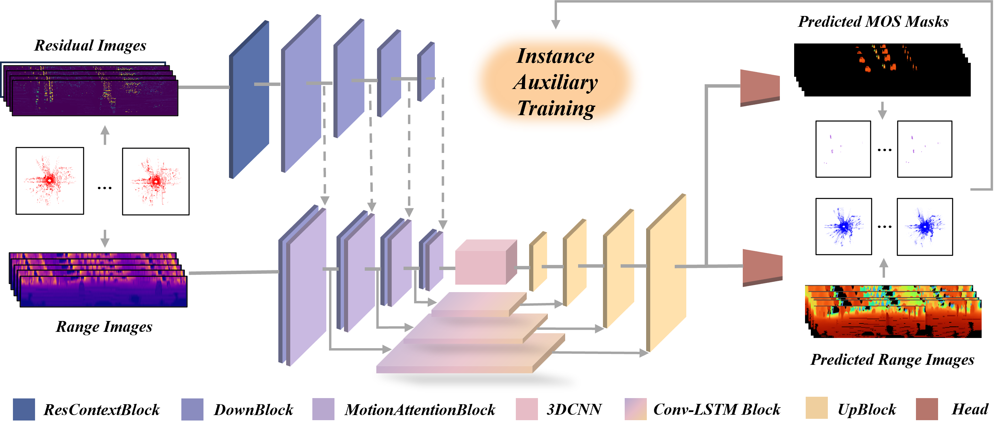

<div align="center">

# IMPNet

</div>

This is a Pytorch-Lightning implementation of the paper

> **Efficient Instance Motion-Aware Point Cloud Scene Prediction**
>
> [Yiming Fang](https://github.com/fyyyym), [Xieyuanli Chen](https://github.com/Chen-Xieyuanli), [Neng Wang](https://github.com/neng-wang), [Kaihong Huang](https://ieeexplore.ieee.org/author/37086935527), [Hesheng Wang](https://irmv.sjtu.edu.cn/wanghesheng),  [Huimin Lu](https://scholar.google.com.hk/citations?hl=en&user=cp-6u7wAAAAJ)

Submitted to **IROS 2025**.

<div align="center">
    <div align="center">
        
    </div>
    <font color=#a0a0a0 size=2>In this paper, we propose IMPNet, a novel instance motion-aware network for future point cloud scene prediction. Unlike prior works, IMPNet explicitly incorporates motion and instance-level information to enhance PCP accuracy. Specifically, we extract appearance and motion features from range images and residual images using a dual-branch convolutional network and fuse them via a motion attention block. Our framework further integrates a motion head for identifying moving objects and an instance-assisted training strategy to improve instance-wise point cloud predictions. Extensive experiments on multiple datasets demonstrate that our proposed network achieves state-of-the-art (SOTA) performance in PCP with superior predictive accuracy and robust generalization across diverse driving scenarios.</font>
</div>


## Table of Contents
1. [Installation](#Installation)
2. [Data](#Data)
3. [Training](#Training)
4. [Testing](#Testing)
5. [Download](#Dwnload)
6. [Acknowledgment](#Acknowledgment)


## Installation

Clone this repository and run 
```bash
cd impnet
git submodule update --init
```
to install the Chamfer distance submodule. The Chamfer distance submodule is originally taken from [here](https://github.com/chrdiller/pyTorchChamferDistance) with some modifications to use it as a submodule. All parameters are stored in ```config/parameters.yaml```.

In our project, all our dependencies are managed by miniconda. 
Use the following command to create the conda environment:

```conda env create -f impnet.yml```

Then activate the environment using the command ```conda activate impnet```

## Data
Download the SemanticKITTI data from the official [website](http://semantic-kitti.org/).

We process the data in advance to speed up training. 
To prepare the dataset from the our dataset, set the value of ```GENERATE_FILES``` to true in ```config/parameters.yaml```.


## Training
After following the [data preparation](#data-preparation) tutorial, the model can be trained in the following way:


The training script can be run by
```bash
python train.py
```
using the parameters defined in ```config/parameters.yaml```. Pass the flag ```--help``` if you want to see more options like resuming from a checkpoint or initializing the weights from a pre-trained model. A directory will be created in ```pcf/runs``` which makes it easier to discriminate between different runs and to avoid overwriting existing logs. The script saves everything like the used config, logs and checkpoints into a path ```pcf/runs/COMMIT/EXPERIMENT_DATE_TIME``` consisting of the current git commit ID (this allows you to checkout at the last git commit used for training), the specified experiment ID (```pcf``` by default) and the date and time.

## Testing
Test your model by running
```bash
python test.py -m COMMIT/EXPERIMENT_DATE_TIME
```


## Download
Please download the model file from (here)


## Acknowledgment

We would like to express our sincere gratitude for the following open-source work that has been immensely helpful in the development of IMPNet.

- [ATPPnet](https://github.com/kaustabpal/ATPPNet): ATPPNet: Attention based Temporal Point cloud Prediction Network.
- [PCPNet](https://github.com/Blurryface0814/PCPNet): PCPNet: An Efficient and Semantic-Enhanced Transformer Network for Point Cloud Prediction.

# **License**

This project is free software made available under the MIT License. For details see the LICENSE file.
